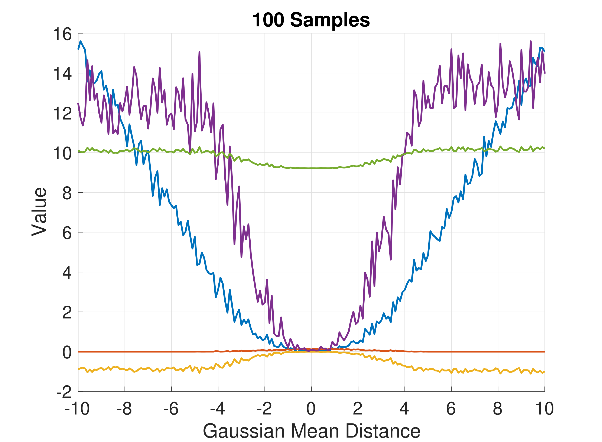
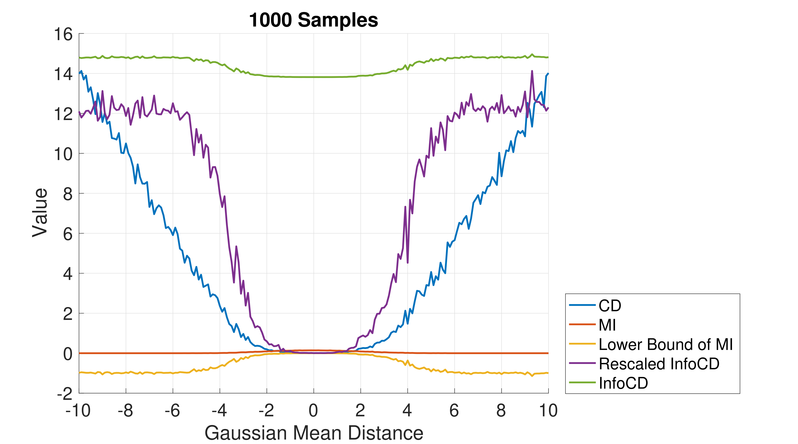

# InfoCD

The official repository of the paper "InfoCD: A Contrastive Chamfer Distance Loss for Point Cloud Completion" published at NeurIPS 2023
## UPDATE
Our code and model weights will be released soon!!!


 | 
*Illustration of comparison among CD, MI, and InfoCD with different numbers of samples.*

### UPDATE 
We update SeedFormer + InfoCD in Oct 13th


## SeedFormer + InfoCD

## Installation

The code has been tested on one configuration:

- python == 3.6.8
- PyTorch == 1.8.1
- CUDA == 10.2
- numpy
- open3d

```
pip install -r requirements.txt
```

Compile the C++ extension modules:

    sh install.sh

## Datasets

The details of used datasets can be found in [DATASET.md](./DATASET.md) 


## Pretrained Models are attached


## Usage

### Training on PCN dataset

First, you should specify your dataset directories in `train_pcn.py`:

    __C.DATASETS.SHAPENET.PARTIAL_POINTS_PATH        = '<*PATH-TO-YOUR-DATASET*>/PCN/%s/partial/%s/%s/%02d.pcd'
    __C.DATASETS.SHAPENET.COMPLETE_POINTS_PATH       = '<*PATH-TO-YOUR-DATASET*>/PCN/%s/complete/%s/%s.pcd'

To train SeedFormer + HyperCD on PCN dataset, simply run:

    python3 train_pcn.py

### Testing on PCN dataset

To test a pretrained model, run:

    python3 train_pcn.py --test

Or you can give the model directory name to test one particular model:

    python3 train_pcn.py --test --pretrained train_pcn_Log_2022_XX_XX_XX_XX_XX

Save generated complete point clouds as well as gt and partial clouds in testing:

    python3 train_pcn.py --test --output 1

### Using ShapeNet-55/34

To use ShapeNet55 dataset, change the data directoriy in `train_shapenet55.py`:

    __C.DATASETS.SHAPENET55.COMPLETE_POINTS_PATH     = '<*PATH-TO-YOUR-DATASET*>/ShapeNet55/shapenet_pc/%s'

Then, run:

    python3 train_shapenet55.py

In order to switch to ShapeNet34, you can change the data file in `train_shapenet55.py`:

    __C.DATASETS.SHAPENET55.CATEGORY_FILE_PATH       = './datasets/ShapeNet55-34/ShapeNet-34/'

The testing process is very similar to that on PCN:

    python3 train_shapenet55.py --test


## Acknowledgement

Code is borrowed from SeedFormer, InfoCD loss can be found in loss_utils.py, This loss can be easily implement to other networks such as PointAttN and CP-Net. 


## Publication
Please cite our papers if you use our idea or code:
```
@inproceedings{
lin2023infocd,
title={InfoCD: A Contrastive Chamfer Distance Loss for Point Cloud Completion},
author={Fangzhou Lin and Yue Yun and Ziming Zhang and Songlin Hou and Kazunori D Yamada and Vijaya Kolachalama and Venkatesh Saligrama},
booktitle={Advances in Neural Information Processing Systems},
editor={},
year={2023},
url={}
}

```

